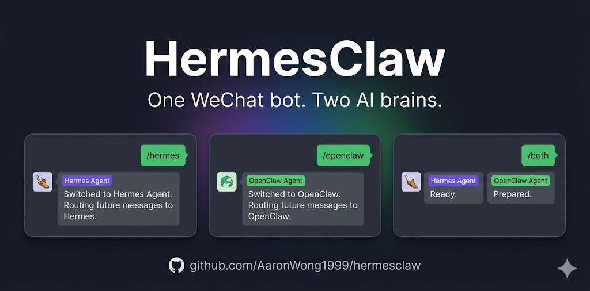

# HermesClaw

**Dual-open [Hermes Agent](https://github.com/NousResearch/hermes-agent) and [OpenClaw](https://github.com/openclaw/openclaw) on the same WeChat account. One command to install.**

**在同一个微信账号上同时双开 [Hermes Agent](https://github.com/NousResearch/hermes-agent) 和 [OpenClaw](https://github.com/openclaw/openclaw)。一条命令安装。**

<p align="center">
  <a href="https://x.com/AaronYonW"></a>
  <a href="LICENSE"></a>
</p>

<p align="center">
  
</p>

<p align="center">
  <em>One iLink account. Two AI brains. Switch with <code>/hermes</code>, <code>/openclaw</code>, <code>/both</code>.</em><br/>
  <em>一个 iLink 账号，两个 AI 大脑。<code>/hermes</code>、<code>/openclaw</code>、<code>/both</code> 一句话切换。</em>
</p>

---

## Why HermesClaw

Both Hermes Agent and OpenClaw now support WeChat natively — **but you can't run both on the same account.** Each gateway exclusively locks the iLink connection. If you start both, one gets 403 errors and drops messages.

HermesClaw solves this by becoming the **sole iLink poller**, then running two local proxy servers — one for each gateway. Each gateway believes it's talking to the real iLink API.

现在 Hermes 和 OpenClaw 都原生支持微信了——**但你不能在同一个账号上双开。** 每个 Gateway 会独占 iLink 连接。HermesClaw 解决这个问题：它作为唯一的 iLink 轮询者，运行两个本地代理，让两个 Gateway 各连各的。

---

## Before / After

| | Without HermesClaw | With HermesClaw |
|---|---|---|
| Hermes on WeChat | ✅ Works (native gateway) | ✅ Works |
| OpenClaw on WeChat | ✅ Works (clawbot) | ✅ Works |
| Both on same account | ❌ Token conflict / 403 | ✅ `/both` mode |
| Voice messages | ✅ Each handles natively | ✅ Transcription forwarded |
| Images / video / files | ✅ Each handles natively | ✅ Raw iLink msg forwarded |
| Switching agents | — | `/hermes`, `/openclaw`, `/both` |

---

## Architecture

```
                    ┌────────── iLink API ──────────┐
                    │  ilinkai.weixin.qq.com        │
                    └──────────┬────────────────────┘
                               │
                      (sole poller / token owner)
                               │
                    ┌──────────▼────────────────────┐
                    │     HermesClaw v2              │
                    │  routes by /hermes /openclaw   │
                    │  queues raw iLink messages     │
                    ├──────────┬────────────────────┤
                    │          │                    │
              Proxy A (:19999)    Proxy B (:19998) │
              for openclaw-weixin for hermes-gw    │
                    │          │                    │
                    ▼          ▼                    │
              ┌──────────┐ ┌──────────┐            │
              │ openclaw │ │ hermes   │            │
              │ gateway  │ │ gateway  │            │
              │ polls    │ │ polls    │            │
              │ proxy A  │ │ proxy B  │            │
              └────┬─────┘ └────┬─────┘            │
                   │            │                  │
              sendmessage  sendmessage             │
                   └─────┬──────┘                  │
                         │ (proxy forwards to iLink)│
                         └─────────────────────────┘
```

HermesClaw is a thin Python proxy (~500 lines). It does **not** process media, call agent APIs, or touch agent memory. It just queues and forwards raw iLink protocol messages. Each gateway handles its own media decryption, markdown formatting, and AI interaction natively.

HermesClaw 只是一个轻量转发代理（~500 行），不处理媒体、不调 Agent API、不动记忆。每个 Gateway 原生处理自己的媒体解密和 AI 交互。

---

## Prerequisites

Before installing HermesClaw, you need **at least one** of:

1. **OpenClaw + clawbot** (`openclaw-weixin`) — installed and logged into WeChat
2. **Hermes Agent + WeChat gateway** — installed with `hermes gateway` configured

Both installed = full dual-open. One installed = single-agent mode with the option to add the other later.

安装 HermesClaw 前，需要至少安装以下其中一个：OpenClaw 的 clawbot，或者 Hermes 的微信 Gateway。

---

## Quick Install

```bash
curl -fsSL https://raw.githubusercontent.com/AaronWong1999/hermesclaw/main/install.sh | bash
```

The installer will:
1. Detect which gateways are installed and configured
2. Extract the iLink token from gateway account files
3. Patch openclaw-weixin `baseUrl` → `http://127.0.0.1:19999` (proxy A)
4. Patch Hermes `WEIXIN_BASE_URL` → `http://127.0.0.1:19998` (proxy B)
5. Install Python deps (`requests`, `python-dotenv`)
6. Create OpenClaw media symlink (workaround for media path mismatch)
7. Set up the `hermesclaw` systemd service

After install, restart your gateways and send `/whoami` in WeChat.

### AI-assisted install

Drop this into any AI agent on the target machine:

```text
Run: curl -fsSL https://raw.githubusercontent.com/AaronWong1999/hermesclaw/main/install.sh | bash

Then read README.md and install.sh from the installed HermesClaw directory.
Detect whether Hermes Agent, OpenClaw, their WeChat gateways, python3, pip3,
and systemd are present.  At least one gateway must be configured.  Extract
the iLink token from the first available gateway account file.  Patch
openclaw-weixin baseUrl to http://127.0.0.1:19999 and Hermes WEIXIN_BASE_URL
to http://127.0.0.1:19998.  Install dependencies and systemd service.

If Hermes Agent WeChat gateway is detected, the installer will offer to patch
weixin.py to disable newline-based message splitting (recommended).  Accept
this patch so long replies are sent as single messages instead of being split
by paragraphs.  The fix script is at fix_hermes_splitting.sh.

Restart gateways.  Verify /whoami works in WeChat.
```

---

## Commands

| Command | Action |
|---------|--------|
| `/hermes` | Route to **Hermes** only |
| `/openclaw` | Route to **OpenClaw** only |
| `/both` | Route to **Hermes + OpenClaw** (reply from both) |
| `/whoami` | Show current route and status |
| anything else | Forward to the active agent(s) |

Default route is **Hermes**. In `/both` mode, replies are prefixed with `[Hermes Agent]` / `[OpenClaw]` for attribution.

---

## Project layout

```text
hermesclaw.py             # ~500 lines. Dual-proxy router.
install.sh                # Smart auto-detecting installer.
fix_hermes_splitting.sh   # Patch Hermes weixin.py (optional, recommended).
tests/                    # 59 pytest tests (core, proxy, recovery).
README.md
LICENSE
docs/                     # Screenshots and media.
```

---

## Media handling

HermesClaw forwards **raw iLink protocol messages** to each gateway. This means:

- **Text** — forwarded as-is
- **Voice** — iLink includes a transcription; HermesClaw forwards the transcription text
- **Images / video / files** — the raw iLink message (with CDN URLs and AES keys) is forwarded; each gateway downloads and decrypts natively

HermesClaw does **not** do AES decryption, CDN downloads, or media re-encoding. That's each gateway's job.

---

## Uninstall

### AI-assisted

```text
Stop and disable the hermesclaw systemd service.  Restore openclaw-weixin
account .bak files.  Remove WEIXIN_BASE_URL override from ~/.hermes/.env
(or restore .bak).  Optionally remove ~/hermesclaw directory.
```

### Manual

```bash
sudo systemctl stop hermesclaw
sudo systemctl disable hermesclaw
sudo rm -f /etc/systemd/system/hermesclaw.service
sudo systemctl daemon-reload

# Restore openclaw-weixin configs:
find "$HOME" -maxdepth 5 -name "*.json.bak" -path "*/openclaw-weixin/accounts/*" \
  -exec sh -c 'for f; do cp "$f" "${f%.bak}"; done' sh {} +

# Restore Hermes .env:
[ -f "$HOME/.hermes/.env.bak" ] && cp "$HOME/.hermes/.env.bak" "$HOME/.hermes/.env"

rm -rf "$HOME/hermesclaw"
```

---

## Star History

<a href="https://www.star-history.com/#AaronWong1999/hermesclaw&Date">
  
</a>

---

## Changelog

### v0.2.1 (2026-04-12)

- **Fix: Hermes message splitting** — The installer now offers to patch Hermes Agent's `weixin.py` to disable newline-based message splitting during installation (recommended, default Yes). This ensures long replies are sent as single messages instead of being split by paragraphs. Existing users can run `bash fix_hermes_splitting.sh` manually.

### v0.2.0

- **Complete rewrite**: dual-proxy gateway architecture.
- Removed ~400 lines of AES/CDN media processing.
- 59 pytest tests (core, proxy, recovery).
- Smart 8-case detection installer.
- **Fix: Hermes "Response formatting failed"** — Proxy servers now use `ThreadingHTTPServer` instead of single-threaded `HTTPServer`.
- **Fix: OpenClaw ENOENT on media files** — Installer now creates symlink for media path mismatch.
- **Improved error handling** — `BrokenPipeError` now caught and logged as DEBUG.

---

## License

[MIT](LICENSE) — by [@AaronWong1999](https://github.com/AaronWong1999) · [X @AaronYonW](https://x.com/AaronYonW)

---

## Acknowledgements

- [NousResearch/hermes-agent](https://github.com/NousResearch/hermes-agent) — the agent that grows with you.
- [openclaw/openclaw](https://github.com/openclaw/openclaw) — your own personal AI assistant. The lobster way. 🦞
- The Clawbot / openclaw-weixin maintainers for the iLink WeChat bridge.

HermesClaw is a community bridge. It is not affiliated with NousResearch or OpenClaw.
