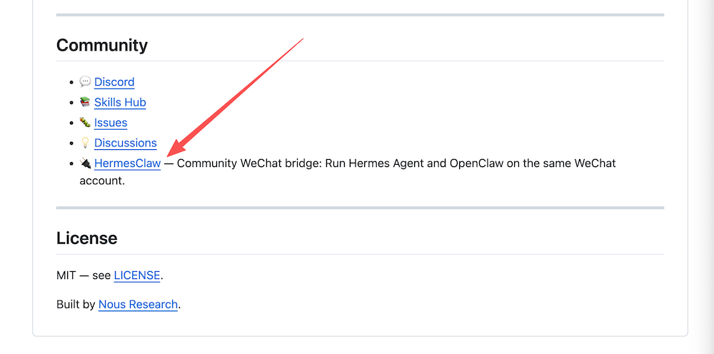

# HermesClaw

**Run [Hermes Agent](https://github.com/NousResearch/hermes-agent), [OpenClaw](https://github.com/openclaw/openclaw), and [OpenCode](https://github.com/sst/opencode) on the same WeChat account. One command to install.**

**在同一个微信账号上同时多开 [Hermes Agent](https://github.com/NousResearch/hermes-agent)、[OpenClaw](https://github.com/openclaw/openclaw) 和 [OpenCode](https://github.com/sst/opencode)。一条命令安装。**

<p align="center">
  <a href="https://x.com/AaronYonW"></a>
  <a href="LICENSE"></a>
</p>

<p align="center">
  
</p>

<p align="center">
  <em>One iLink account. Three AI brains. Switch with <code>/hermes</code>, <code>/openclaw</code>, <code>/opencode</code>, <code>/both</code>, <code>/three</code>.</em><br/>
  <em>一个 iLink 账号，三个 AI 大脑。<code>/hermes</code>、<code>/openclaw</code>、<code>/opencode</code>、<code>/both</code>、<code>/three</code> 一句话切换。</em>
</p>

---

## Why HermesClaw

Both Hermes Agent and OpenClaw now support WeChat natively — **but you can't run both on the same account.** Each gateway exclusively locks the iLink connection. If you start both, one gets 403 errors and drops messages. OpenCode adds a third AI brain via its ACP subprocess protocol.

HermesClaw solves this by becoming the **sole iLink poller**, then running two local proxy servers (for Hermes and OpenClaw) plus a direct ACP bridge (for OpenCode). Each gateway believes it's talking to the real iLink API.

The new OpenCode support also lets you **Vibe Code via WeChat voice messages** — just speak and OpenCode handles it, backed by four free models including MiniMax M2.5 Free. You can also use it alongside the other two agents to complement each other — fixing their issues, tracing bugs, or inspecting the local environment.

现在 Hermes 和 OpenClaw 都原生支持微信了——**但你不能在同一个账号上双开。** 每个 Gateway 会独占 iLink 连接。HermesClaw 解决这个问题：它作为唯一的 iLink 轮询者，运行两个本地代理，让两个 Gateway 各连各的。

新版还增加了 OpenCode 支持，现在你可以用微信语音直接进行 **Vibe Coding** 了，调用的就是 OpenCode 中包含 MiniMax M2.5 Free 在内的四个免费模型。你也可以用它和另外两个 Agent 互相补充使用，比如帮它们修问题、查 bug、看本机环境。

---

## Special Thanks

Special thanks to the [Hermes Agent](https://github.com/NousResearch/hermes-agent) team at Nous Research for recognizing and recommending **HermesClaw** in the `Community` section of their official GitHub README.

特别感谢 Nous Research 的 [Hermes Agent](https://github.com/NousResearch/hermes-agent) 团队，在其 GitHub 官方 README 的 `Community` 区收录并推荐 **HermesClaw**。

<p align="center">
  
</p>

> Official reference:
> [Hermes Agent README - Community](https://github.com/NousResearch/hermes-agent)

---

## Before / After

| | Without HermesClaw | With HermesClaw |
|---|---|---|
| Hermes on WeChat | ✅ Works (native gateway) | ✅ Works |
| OpenClaw on WeChat | ✅ Works (clawbot) | ✅ Works |
| OpenCode on WeChat | ❌ No WeChat support | ✅ via ACP bridge |
| Both on same account | ❌ Token conflict / 403 | ✅ `/both` mode |
| All three on same account | ❌ Impossible | ✅ `/three` mode |
| Voice messages | ✅ Each handles natively | ✅ Transcription forwarded |
| Images / video / files | ✅ Each handles natively | ✅ Raw iLink msg forwarded |
| Switching agents | — | `/hermes`, `/openclaw`, `/opencode`, `/both`, `/three` |

---

## Architecture

```
                    ┌────────── iLink API ──────────┐
                    │  ilinkai.weixin.qq.com        │
                    └──────────┬────────────────────┘
                               │
                      (sole poller / token owner)
                               │
                    ┌──────────▼────────────────────┐
                    │     HermesClaw v3              │
                    │  routes by /hermes /openclaw   │
                    │          /opencode /three      │
                    │  queues raw iLink messages     │
                    ├────────┬──────────┬────────────┤
                    │        │          │
              Proxy A      Proxy B    ACP Bridge
              (:19999)     (:19998)   (subprocess)
              openclaw     hermes     opencode acp
                    │        │          │
                    ▼        ▼          ▼
              ┌──────────┐ ┌──────────┐ ┌──────────┐
              │ openclaw │ │ hermes   │ │ opencode │
              │ gateway  │ │ gateway  │ │ process  │
              └────┬─────┘ └────┬─────┘ └────┬─────┘
                   │            │             │
              sendmessage  sendmessage   send_text_ilink
                   └─────┬──────┘            │
                         │ (proxy forwards)  │
                         └──────────────────►┘
                                to iLink
```

HermesClaw is a thin Python proxy (~500 lines). It does **not** process media, call agent APIs, or touch agent memory. It just queues and forwards raw iLink protocol messages. Each gateway handles its own media decryption, markdown formatting, and AI interaction natively.

HermesClaw 只是一个轻量转发代理（~500 行），不处理媒体、不调 Agent API、不动记忆。每个 Gateway 原生处理自己的媒体解密和 AI 交互。

---

## Prerequisites

Before installing HermesClaw, you need **at least one** of:

1. **OpenClaw + clawbot** (`openclaw-weixin`) — installed and logged into WeChat
2. **Hermes Agent + WeChat gateway** — installed with `hermes gateway` configured

Both installed = full dual-open. One installed = single-agent mode with the option to add the other later.

安装 HermesClaw 前，需要至少安装以下其中一个：OpenClaw 的 clawbot，或者 Hermes 的微信 Gateway。

---

## Quick Install

```bash
curl -fsSL https://raw.githubusercontent.com/AaronWong1999/hermesclaw/main/install.sh | bash
```

For **non-interactive / automated** installs (skips all confirmation prompts):

```bash
curl -fsSL https://raw.githubusercontent.com/AaronWong1999/hermesclaw/main/install.sh | HERMESCLAW_YES=1 bash
# or, when running the script directly:
bash install.sh -y
```

The installer will:
1. Detect which gateways are installed and configured
2. Extract the iLink token from gateway account files
3. Patch openclaw-weixin `baseUrl` → `http://127.0.0.1:19999` (proxy A)
4. Patch Hermes `WEIXIN_BASE_URL` → `http://127.0.0.1:19998` (proxy B)
5. Detect OpenCode CLI (optional — enables `/opencode` and `/three`)
6. Install Python deps (`requests`, `python-dotenv`)
7. Create OpenClaw media symlink (workaround for media path mismatch)
8. Set up the `hermesclaw` systemd service

After install, restart your gateways and send `/whoami` in WeChat.

### AI-assisted install

Drop this into any AI agent on the target machine:

```text
Run: curl -fsSL https://raw.githubusercontent.com/AaronWong1999/hermesclaw/main/install.sh | bash

Then read README.md and install.sh from the installed HermesClaw directory.
Detect whether Hermes Agent, OpenClaw, their WeChat gateways, python3, pip3,
and systemd are present.  At least one gateway must be configured.  Extract
the iLink token from the first available gateway account file.  Patch
openclaw-weixin baseUrl to http://127.0.0.1:19999 and Hermes WEIXIN_BASE_URL
to http://127.0.0.1:19998.  Install dependencies and systemd service.

Also detect OpenCode CLI: run `command -v opencode` or check
~/.npm-global/bin/opencode.  If not found, suggest installing with:
  npm install -g opencode-ai
Set OPENCODE_CMD in .env to the detected path (or empty if not found).
OPENCODE_MODEL defaults to opencode/minimax-m2.5-free (free, no API key needed).

If Hermes Agent WeChat gateway is detected, the installer will offer to patch
weixin.py to disable newline-based message splitting (recommended).  Accept
this patch so long replies are sent as single messages instead of being split
by paragraphs.  The fix script is at fix_hermes_splitting.sh.

Restart gateways.  Verify /whoami works in WeChat.
```

---

## Commands

| Command | Action |
|---------|--------|
| `/hermes` | Route to **Hermes** only |
| `/openclaw` | Route to **OpenClaw** only |
| `/opencode` | Route to **OpenCode** only (via ACP bridge) |
| `/both` | Route to **Hermes + OpenClaw** (reply from both) |
| `/three` | Route to **all three** (reply from all) |
| `/whoami` | Show current route and status |
| anything else | Forward to the active agent(s) |

Default route is **Hermes**. In `/both` and `/three` modes, proxy replies are prefixed with `[Hermes Agent]` / `[OpenClaw]` / `[OpenCode]` for attribution.

### OpenCode setup

OpenCode connects via its native ACP subprocess protocol — no proxy port needed. Install it first:

```bash
npm install -g opencode-ai
```

Then set `OPENCODE_CMD` in `.env` (the installer auto-detects it). Use `/opencode` or `/three` once OpenCode is installed.

---

## Project layout

```text
hermesclaw.py             # ~870 lines. Triple-proxy router + ACP bridge.
install.sh                # Smart auto-detecting installer (-y for non-interactive).
fix_hermes_splitting.sh   # Patch Hermes weixin.py (optional, recommended).
tests/                    # 82 pytest tests (core, proxy, ACP, recovery).
README.md
LICENSE
docs/                     # Screenshots and media.
```

---

## Media handling

HermesClaw forwards **raw iLink protocol messages** to each gateway. This means:

- **Text** — forwarded as-is
- **Voice** — iLink includes a transcription; HermesClaw forwards the transcription text
- **Images / video / files** — the raw iLink message (with CDN URLs and AES keys) is forwarded; each gateway downloads and decrypts natively

HermesClaw does **not** do AES decryption, CDN downloads, or media re-encoding. That's each gateway's job.

---

## Uninstall

### AI-assisted

```text
Stop and disable the hermesclaw systemd service.  Restore openclaw-weixin
account .bak files.  Remove WEIXIN_BASE_URL override from ~/.hermes/.env
(or restore .bak).  Optionally remove ~/hermesclaw directory.
```

### Manual

```bash
sudo systemctl stop hermesclaw
sudo systemctl disable hermesclaw
sudo rm -f /etc/systemd/system/hermesclaw.service
sudo systemctl daemon-reload

# Restore openclaw-weixin configs:
find "$HOME" -maxdepth 5 -name "*.json.bak" -path "*/openclaw-weixin/accounts/*" \
  -exec sh -c 'for f; do cp "$f" "${f%.bak}"; done' sh {} +

# Restore Hermes .env:
[ -f "$HOME/.hermes/.env.bak" ] && cp "$HOME/.hermes/.env.bak" "$HOME/.hermes/.env"

rm -rf "$HOME/hermesclaw"
```

---

## Star History

<a href="https://www.star-history.com/#AaronWong1999/hermesclaw&Date">
  
</a>

---

## Changelog

### v0.3.0

- **OpenCode ACP bridge** — New `OpenCodeBridge` + `ACPSession` classes implement JSON-RPC 2.0 over NDJSON for `opencode acp` subprocess. Per-user sessions with automatic reconnect.
- **`/opencode` command** — Route messages to OpenCode only.
- **`/three` command** — Route messages to all three agents simultaneously (Hermes + OpenClaw + OpenCode).
- **"Not installed" detection** — If `opencode` binary is not found, `/opencode` and `/three` show a helpful install hint instead of crashing.
- **Tagging in THREE mode** — Proxy tags Hermes/OpenClaw replies; OpenCode worker tags its own replies with `[OpenCode]`.
- **Dead subprocess recovery** — If OpenCode exits mid-session, pending prompts unblock immediately with an error instead of hanging for the full 120 s timeout.
- **Headless ACP permissions** — OpenCode permission prompts are handled automatically with `OPENCODE_PERMISSION_STRATEGY=allow_always`, preventing WeChat replies from hanging on non-interactive tool approvals. The OpenCode global config (`~/.config/opencode/opencode.json`) is also set to `"permission": "allow"` by the installer so tool calls are approved at the OpenCode level without round-tripping through ACP.
- **OpenCode typing indicator** — OpenCode mode now sends and keeps alive the WeChat typing indicator while the ACP agent is working.
- **Non-interactive installer** — `bash install.sh -y` (or `HERMESCLAW_YES=1 bash install.sh`) skips all confirmation prompts; OpenCode appears in the discovery summary.
- **Installer git pull** — Re-running install.sh on an existing install now pulls the latest code before continuing.
- **117 tests** — Expanded route matrix covers every command route across text, voice, image, video, and file payloads, plus ACP permissions, OpenCode media prompts, dead-subprocess recovery, and THREE mode.

### v0.2.1 (2026-04-12)

- **Fix: Hermes message splitting** — The installer now offers to patch Hermes Agent's `weixin.py` to disable newline-based message splitting during installation (recommended, default Yes). This ensures long replies are sent as single messages instead of being split by paragraphs. Existing users can run `bash fix_hermes_splitting.sh` manually.

### v0.2.0

- **Complete rewrite**: dual-proxy gateway architecture.
- Removed ~400 lines of AES/CDN media processing.
- 59 pytest tests (core, proxy, recovery).
- Smart 8-case detection installer.
- **Fix: Hermes "Response formatting failed"** — Proxy servers now use `ThreadingHTTPServer` instead of single-threaded `HTTPServer`.
- **Fix: OpenClaw ENOENT on media files** — Installer now creates symlink for media path mismatch.
- **Improved error handling** — `BrokenPipeError` now caught and logged as DEBUG.

---

## License

[MIT](LICENSE) — by [@AaronWong1999](https://github.com/AaronWong1999) · [X @AaronYonW](https://x.com/AaronYonW)

---

## Credits

- [NousResearch/hermes-agent](https://github.com/NousResearch/hermes-agent) — the agent that grows with you.
- [openclaw/openclaw](https://github.com/openclaw/openclaw) — your own personal AI assistant. The lobster way. 🦞
- The Clawbot / openclaw-weixin maintainers for the iLink WeChat bridge.

HermesClaw is a community bridge. It is not affiliated with NousResearch or OpenClaw.
