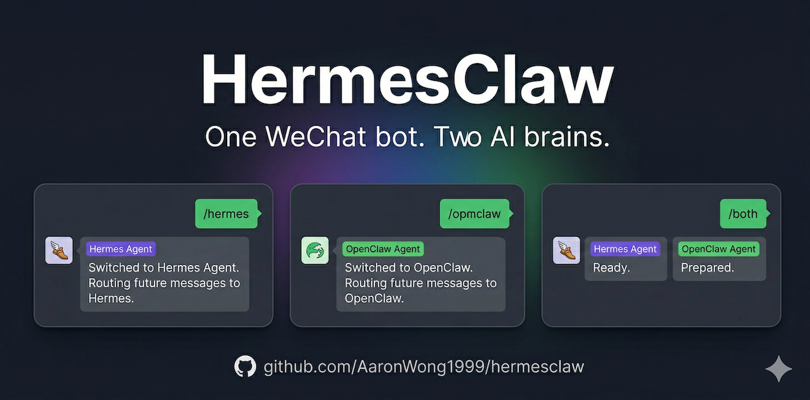
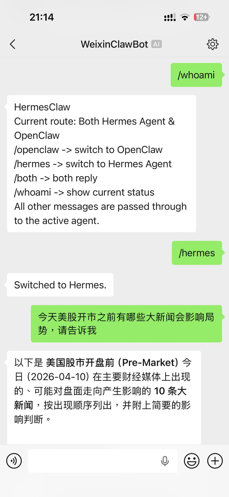
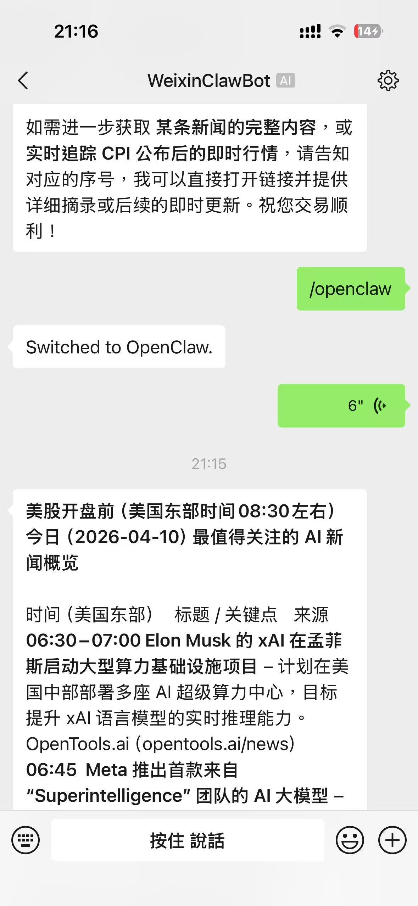
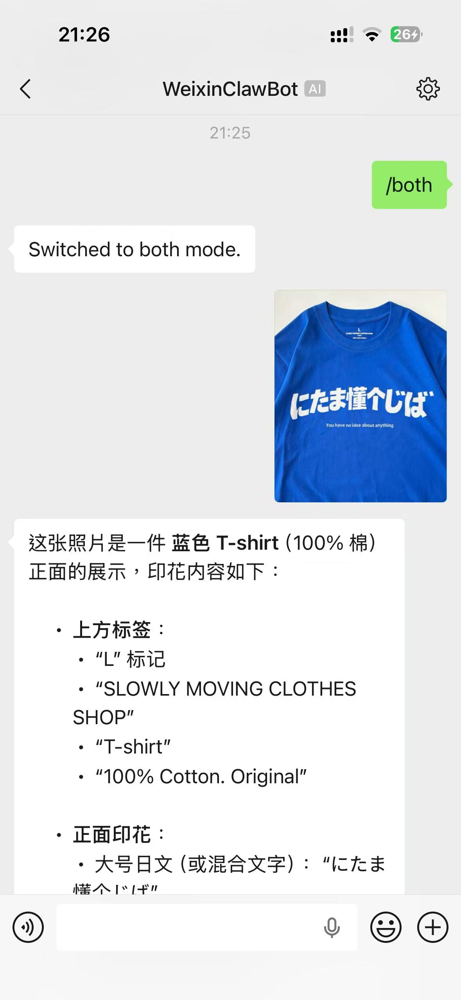
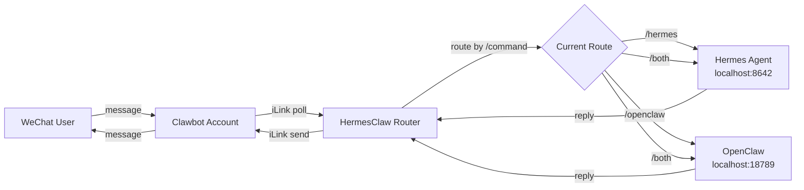

# HermesClaw

**Run [Hermes Agent](https://github.com/NousResearch/hermes-agent) and [OpenClaw](https://github.com/openclaw/openclaw) on the same WeChat account. One command to install.**

**在同一个微信账号上同时跑 [Hermes Agent](https://github.com/NousResearch/hermes-agent) 和 [OpenClaw](https://github.com/openclaw/openclaw)。一条命令安装。**

<p align="center">
  
</p>

<p align="center">
  <a href="LICENSE"></a>
  
  
  <a href="https://github.com/AaronWong1999/hermesclaw/stargazers"></a>
  <a href="https://github.com/AaronWong1999/hermesclaw/network/members"></a>
</p>

<p align="center">
  
  
  
</p>

<p align="center">
  <em>One Clawbot account. Two AI brains. Switch with <code>/hermes</code>, <code>/openclaw</code>, <code>/both</code>.</em><br/>
  <em>一个 Clawbot 账号，两个 AI 大脑。<code>/hermes</code>、<code>/openclaw</code>、<code>/both</code> 一句话切换。</em>
</p>

---

## Why HermesClaw

- **Hermes Agent has no native WeChat support.** It works on Telegram, Discord, Slack, WhatsApp, Signal — but not WeChat. HermesClaw fills the gap by piggybacking on OpenClaw's existing Clawbot infrastructure.
- **OpenClaw users on WeChat can now run Hermes Agent in parallel.** No second account, no second QR code, no second device.
- **Voice, image, video, and file messages all forward through.** Voice arrives at Hermes as a transcription. Images/videos/files arrive as decrypted local file paths Hermes can read with vision tools.
- **One-line install.** `curl | bash` auto-detects Hermes, OpenClaw, clawbot, Python, systemd. Reuses your existing config when it can. Patches Clawbot to point at HermesClaw.

**痛点**：Hermes Agent 不支持微信；微信只能跑 OpenClaw，没法双开。HermesClaw 让一个 Clawbot 同时挂两个 Agent，文本/语音/图片/视频/文件全转发，一行命令装完。

---

## Quick Install

```bash
curl -fsSL https://raw.githubusercontent.com/AaronWong1999/hermesclaw/main/install.sh | bash
```

That's it. The installer detects what's already on your machine and only installs what's missing.

就这一句。安装脚本会自动检测已有环境，缺什么补什么。

### Or let an AI do it for you · 让 AI 替你装

Drop one of these prompts into Hermes, Claude Code, or any agent CLI on the target machine:

```text
Run: curl -fsSL https://raw.githubusercontent.com/AaronWong1999/hermesclaw/main/install.sh | bash

Then read README.md and install.sh from the installed HermesClaw directory. Detect whether
Hermes, OpenClaw, clawbot/openclaw-weixin, python3, pip3, node, npx, and systemd are
installed. Reuse existing config when found. If clawbot is missing, install it first. If
Hermes or OpenClaw is missing, stop and print exact next actions instead of guessing. Only
patch clawbot to HermesClaw after clawbot itself already works. Keep iterating until
/whoami works in WeChat.
```

```text
先执行：curl -fsSL https://raw.githubusercontent.com/AaronWong1999/hermesclaw/main/install.sh | bash

然后读取安装后的 HermesClaw 目录里的 README.md 和 install.sh。检测 Hermes、OpenClaw、
clawbot/openclaw-weixin、python3、pip3、node、npx、systemd 是否已安装。能复用现有配置就复用。
缺 clawbot 就先装 clawbot。缺 Hermes 或 OpenClaw 时不要瞎猜，直接打印下一步要做的事。
只有在 clawbot 本身已经能跑之后，才把它改到 HermesClaw。一直迭代直到微信里的 /whoami 可用。
```

---

## Before / After

| | Without HermesClaw | With HermesClaw |
|---|---|---|
| Hermes Agent on WeChat | ❌ Not supported | ✅ Works |
| OpenClaw on WeChat | ✅ Works | ✅ Still works |
| Run both on one account | ❌ Impossible | ✅ `/both` |
| Voice messages → Hermes | ❌ | ✅ Transcribed |
| Images / files → Hermes | ❌ | ✅ Forwarded as local paths |
| Switching agents | — | `/hermes`, `/openclaw`, `/both` |

---

## Architecture



HermesClaw is a thin Python proxy. It only does routing and forwarding — it does not rewrite agent memory and does not try to replace anything either side already does. Per-user route state lives in `router_state.json`.

HermesClaw 只是一个轻量 Python 代理，只做路由转发，不动 agent 记忆。每个用户的当前路由存在 `router_state.json`。

---

## Commands · 指令

| Command | Action |
|---------|--------|
| `/hermes` | Route to **Hermes** only |
| `/openclaw` | Route to **OpenClaw** only |
| `/both` | Route to **Hermes + OpenClaw** (reply from both) |
| `/whoami` | Show current route and help |
| anything else | Forward to the active agent(s) |

Default route is **Hermes**. Voice messages are delivered as transcription text. Images, videos, and files are downloaded, AES-decrypted, and handed to Hermes as local file paths.

默认路由是 **Hermes**。语音以转写文本形式投递；图片/视频/文件会被下载、AES 解密，再以本地路径交给 Hermes。

---

## How the installer works

1. Detect Hermes, OpenClaw, clawbot/openclaw-weixin, Python, `npx`, and systemd.
2. Reuse existing config when possible.
3. Install clawbot first if it's missing and installable.
4. Read the configured Hermes / OpenClaw endpoints (or fall back to defaults).
5. Read the iLink token from the existing clawbot account config.
6. Patch clawbot to point at HermesClaw's local proxy.
7. Write `.env` and install the `hermesclaw.service` systemd unit.

After install, send `/whoami` to your Clawbot in WeChat to confirm it's alive.

装完之后，在微信里给 Clawbot 发 `/whoami`，看到路由信息就说明跑起来了。

---

## Project layout

```text
hermesclaw.py        # 763 lines, single file. The whole router.
install.sh           # Smart auto-detecting installer.
uninstall.sh         # Reverses the install (or use the AI prompt below).
README.md
LICENSE
docs/screenshots/    # Demo screenshots used in this README.
```

The project is intentionally minimal. One Python file, no external state besides `router_state.json` and `.env`.

刻意保持极简：一个 Python 文件，全部状态只在 `router_state.json` 和 `.env`。

---

## Media handling

HermesClaw forwards text, voice transcription, images, videos, and files. Voice arrives in this format so Hermes can quote it cleanly:

```text
[The user sent a voice message. Here's what they said: "..."]
```

Images/videos/files are downloaded into the HermesClaw directory and passed to Hermes as local file paths (not base64 blobs). Raw audio bytes are not forwarded — only transcription text.

图片/视频/文件会下载到 HermesClaw 目录，以本地路径的形式给到 Hermes，不会传 base64。原始音频字节不会被转发，只发转写文本。

---

## Uninstall

If your environment is non-standard, let an AI handle it:

```text
Read README.md and inspect the current machine. Find the HermesClaw project directory,
the hermesclaw systemd service, and any clawbot/openclaw-weixin account configs that
were patched to point at HermesClaw. Stop and disable hermesclaw.service, remove the
service file, restore any *.json.bak account config backups if they exist, and only
then remove the HermesClaw project directory after showing what will be deleted.
```

Or do it manually:

```bash
sudo systemctl stop hermesclaw
sudo systemctl disable hermesclaw
sudo rm -f /etc/systemd/system/hermesclaw.service
sudo systemctl daemon-reload
find "$HOME" -maxdepth 5 -type f -name "*.json.bak" -path "*/openclaw-weixin/accounts/*" \
  -exec sh -c 'for f; do cp "$f" "${f%.bak}" && rm -f "$f"; done' sh {} +
rm -rf "$HOME/hermesclaw"
```

---

## Star History

<a href="https://www.star-history.com/#AaronWong1999/hermesclaw&Date">
  
</a>

---

## License

[MIT](LICENSE) © [@aaronwong1999](https://github.com/AaronWong1999)

---

## Acknowledgements · 致谢

- [NousResearch/hermes-agent](https://github.com/NousResearch/hermes-agent) — the agent that grows with you.
- [openclaw/openclaw](https://github.com/openclaw/openclaw) — your own personal AI assistant. The lobster way. 🦞
- The Clawbot / openclaw-weixin maintainers for the iLink WeChat bridge that made this possible.

HermesClaw is a community bridge. It is not affiliated with NousResearch or OpenClaw.

HermesClaw 是一个社区桥接工具，与 NousResearch 和 OpenClaw 没有官方隶属关系。
